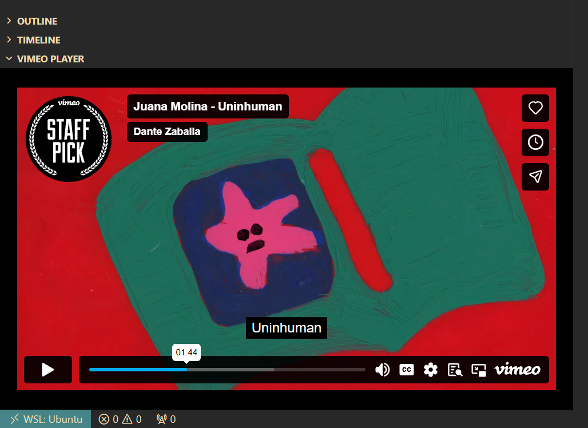

# Vimeo Player for VS Code

A VS Code extension that embeds Vimeo videos in a dockable panel. Watch Vimeo content without leaving your editor.



Part of [Bombing Around](https://github.com/Bombing-Around) — learning repos and experiments.

## Why does this exist?

A friend was building an **audio player extension** for VS Code. I joked: _“What about an embedded video player?”_ — the kind of throwaway line you say while multitasking. Then I thought _“…actually, let’s try it.”_

So this is that experiment: a video player that lives inside the editor. It didn’t end up as the universal YouTube/Vimeo/Twitch dream (embed policies had other ideas), but Vimeo works great, the panel is dockable, and the whole thing became a solid lessons-learned project. Consider it equal parts utility and “I said the bit and then did the bit.”

## Features

- **Dockable panel** — Video opens in the Vimeo Player view in the panel (bottom pane by default; you can drag the panel to the left or right). Run the command and paste a URL to load.
- **Command palette** — Run "Open Vimeo Video", paste a URL, and watch
- **Fallback link** — If the embed has issues, click through to open on Vimeo in your browser

## Usage

1. Open the Command Palette (`Ctrl+Shift+P` / `Cmd+Shift+P`)
2. Run **Open Vimeo Video**
3. Paste a Vimeo URL (e.g. `https://vimeo.com/347119375`) and press Enter

The video opens in the Vimeo Player view in the panel (bottom by default). You can drag the panel to the left or right sidebar if you prefer.

## Requirements

- VS Code 1.74.0 or newer
- Vimeo video URLs (standard format: `https://vimeo.com/VIDEO_ID` or `https://player.vimeo.com/video/VIDEO_ID`)

## Development

```bash
# Install dependencies
npm install

# Compile TypeScript
npm run compile

# Watch for changes
npm run watch
```

**Run from source**

1. Open this folder in VS Code
2. Press `F5` to launch the Extension Development Host
3. In the new window, run "Open Vimeo Video" and paste a Vimeo URL

## Lessons Learned

This extension started as a **generic video player** for YouTube, Vimeo, and Twitch. It was rebranded to Vimeo-only after hitting platform limits. Here’s what we learned.

### What worked

- **Vimeo** — Embeds reliably inside VS Code webviews. No special referrer or origin checks that block the embed.
- **Webview views** — `WebviewViewProvider` lets you create a view in the panel (bottom) or sidebar. The video loads there and stays docked.
- **Content Security Policy** — Webviews need a CSP that allows `frame-src` (or equivalent) for the embed domain (e.g. `https://player.vimeo.com`). Restrict to the minimum required for the player.

### What didn’t work

- **YouTube** — Embedding fails with `embedder.identity.missing.referrer` (Error 153). YouTube’s embed player expects a normal HTTP/HTTPS referrer. VS Code webviews use a `vscode-webview://` origin that YouTube does not accept. This is a deliberate restriction on YouTube’s side, not something fixable in the extension. Workarounds we tried:

  - `youtube-nocookie.com` — Same behavior
  - Adding `origin` / referrer-related query params — No effect
  - Relaxing CSP / iframe attributes — No effect
  - VS Code’s Simple Browser — Did not open or behave reliably in our tests
  - **Conclusion:** For YouTube, opening in the user’s normal browser (e.g. via `vscode.env.openExternal`) is the reliable option, but that’s outside the editor.

- **Twitch** — Embeds require a valid `parent` domain. Twitch’s player checks the parent URL and does not accept `vscode-webview://`. The result was a black screen. Supporting Twitch would require either a different embedding strategy (if Twitch ever supports it) or opening in an external browser.

### Takeaway

Embedding third-party video in a VS Code extension depends entirely on that platform’s embed policy. Vimeo’s policy works with webview origins; YouTube’s and Twitch’s (in our testing) do not. If you’re building something similar, validate each platform inside a webview early and be prepared to narrow scope or use “open in browser” for strict platforms.

So: one friend shipped audio in the editor. This one ships video (Vimeo edition). The bit was followed through.

## License

MIT
